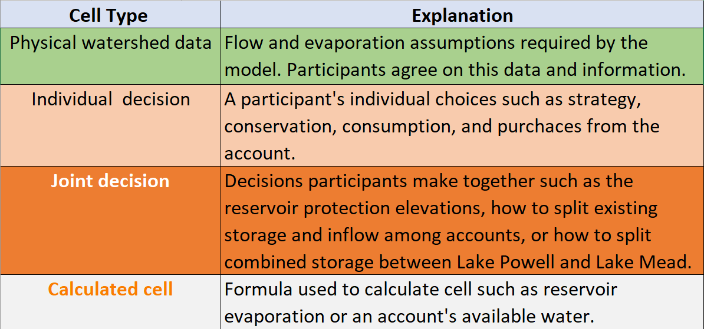
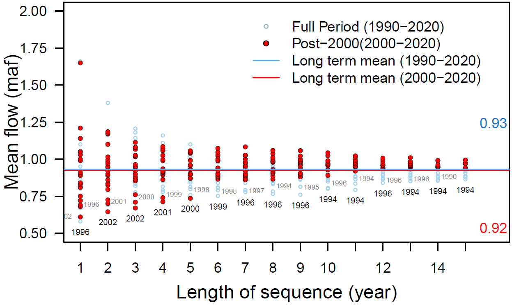
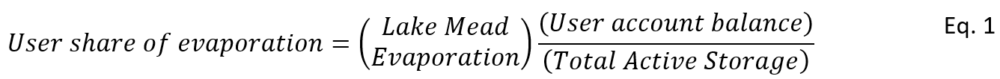
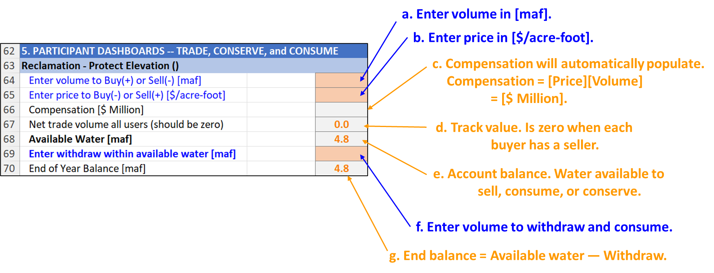
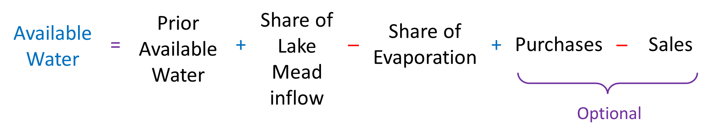

# Model Guide

## Immersive Model for Lake Mead Based on the Principle of Divide Reservoir Inflow

David E. Rosenberg, Anabelle Myers

Utah State University

[david.rosenberg@usu.edu](mailto:david.rosenberg@usu.edu)

<http://rosenberg.usu.edu>

August 4, 2025

# I**ntroduction**

The purpose of this tool is to give users the opportunity to immerse in and
personify water user roles for a Lake Mead model based on the principle of
divide reservoir inflow. The process is: **A) Divide reservoir inflow**, **B)
Subtract evaporation**, and **C) Users withdraw and conserve within their
available water**, others choices, and real-time discussion of choices. We see
uses of the tool for two purposes:

-   As researchers we want to learn *Why* basin partners choose assumptions and
    *how* extreme; *Why* and *how* basin partners articulate their risk of
    uncertain future water supply and manage their vulnerability; and *Which*
    new insights they take from a model session.

-   Provoke thought and discussion to:

    -   Stabilize and recover reservoir storage under conditions of low storage
        *and* low inflow.

    -   Give users more autonomy to manage their conflicting vulnerabilities to
        water shortages.

# Key Model Ideas

1.  **Lake Mead water level is the sum of the protection elevation plus each
    user’s available water.**

    

2.  **Each user manages all their available water not just prior conserved
    water.**

1.  **Tribal Nations of the Lower Basin manage their own settled water rights**

This User Guide provides context information for each individual and group
choice within the immersive model. The document also explains how choices build
on existing Colorado River management (Appendix A). The document also suggests
potential values to enter for user choices.

Find quick links to this support information -- the sections and subsections of
this document -- in the Model file, *Master* worksheet, Column N.

Requirements

-   **Session Guide**: 1 person to setup in Google Sheets (see Setup below),
    invite participants, and organize play.

-   **Number of People**: 2 or more (Session Guide may also participate).

-   **Time**: 1 to 3 hours.

-   **Software**: Session Guide has a Google Account.

# Instructions to Guide a Model Session

Review the main canons of existing Colorado River management (Appendix A;
persons not familiar with current Colorado River operations).

Follow the setup and play
instructions (Box 1). The rest of the document provides guidance on each step.

## Types of Use

The model can be used in two modes:

1.  Synchronously by multiple participants where each participant manages one or
    more accounts (in Google Drive).

2.  By a single participant (manages all accounts).

Participants can explore:

-   Water conservation and consumptive use strategies.

-   Scenarios of Lake Mead inflow.

-   Joint (political) decisions such as:

    -   Split existing reservoir storage among accounts.

    -   Split future inflows among accounts.

# Step 1. Assign Accounts, Articulate Vulnerabilities, and Strategies to Manage Vulnerability

The Reclamation, California, Arizona, Nevada, and Mexico accounts represent
entities defined in the 1922 Colorado River Compact, US-Mexico Treaty of 1948,
subsequent Minutes 319 and 323, Lower Basin drought contingency plans, and
pledges to include more accounts (Table 1a)(1922; IBWC, 2021; USBR, 2019; USBR,
2020). The Tribal Nations of the Lower Basin users represents Tribal Nations and
their settled water rights (Ten Tribes Partnership, 2018).

**Maps of water user areas**

-   [Upper Basin, Lower Basin,
    Mexico](https://www.usbr.gov/lc/images/maps/CRBSmap.jpg) (USGS, 2016)

-   [First
    Nations](http://www.naturalresourcespolicy.org/images/col-river-basin/map-tribes-crb.jpg)
    (Ten Tribes Partnership, 2018)

**Table 1a. Accounts, Reason(s) to include in model, and Potential Strategies**

| **Account**                       |                                                                                                             | **Potential Strategy(s)**                                                                                                                                                                                                                                                                                                                                                                                                                           |
|-----------------------------------|-------------------------------------------------------------------------------------------------------------|-----------------------------------------------------------------------------------------------------------------------------------------------------------------------------------------------------------------------------------------------------------------------------------------------------------------------------------------------------------------------------------------------------------------------------------------------------|
| Reclamation                       | Article II(c to g) of the Colorado River Compact (1922). Lower Basin Drought Contingency Plan (USBR, 2019). | Set Lake Mead Protection Elevation of 1,020 feet as defined in the Lower Basin Drought Contingency Plan (USBR, 2019). Lake Mead will not fall below this level. Lower the protection elevation to allocate more active storage to other users                                                                                                                                                                                                       |
| California                        | Article II(c to g) of the Colorado River Compact (1922).                                                    | Continue mandatory conservation and cutback from 4.4 maf per year as Lake Mead level declines from 1,090 to 1,025 feet (USBR, 2019). See cutback schedule in *MandatoryConservation* sheet. These values exclude 0.95 maf per year of use by First Nations in the Lower Basin. Cut back an addition amount per year to represent the 500-Plus Plan (Allhands, 2021). Buy water to reduce mandatory conservation.  Save some water for future years. |
| Arizona                           | Article II(c to g) of the Colorado River Compact (1922).                                                    | Continue mandatory conservation and cutback from 2.8 maf per year as Lake Mead level declines from 1,090 to 1,025 feet (USBR, 2019). See cutback schedule in *MandatoryConservation* sheet. These values exclude 0.95 maf per year of use by First Nations in the Lower Basin. Cut back an addition amount per year to represent the 500-Plus Plan (Allhands, 2021). Buy water to reduce mandatory conservation.  Save some water for future years. |
| Nevada                            | Article II(c to g) of the Colorado River Compact (1922).                                                    | Continue mandatory conservation and cutback from 0.3 maf per year as Lake Mead level declines from 1,090 to 1,025 feet (USBR, 2019). See cutback schedule in *MandatoryConservation* sheet. These values exclude 0.95 maf per year of use by First Nations in the Lower Basin. Cut back an addition amount per year to represent the 500-Plus Plan (Allhands, 2021). Buy water to reduce mandatory conservation.  Save some water for future years. |
| Mexico                            | 1944 U.S.-Mexico Treaty and subsequent Minutes                                                              | Continue mandatory conservation and cutback from 1.5 maf per year as Lake Mead levels decline (IBWC, 2021). See *MandatoryConservation* sheet. Conserve more water beyond mandatory targets. Lease water to get money for non-water projects.                                                                                                                                                                                                       |
| Tribal Nations of the Lower Basin | Include more accounts (USBR, 2020) Tribal water study (Ten Tribes Partnership, 2018)                        | Currently 0.47 of 0.95 million acre-feet of settled water rights are used and consumed (Ten Tribes Partnership, 2018). Lease settled, undeveloped water to other users to acquire capital to build new projects. Save water for future use.                                                                                                                                                                                                         |

A participant can play one or more accounts.

The First Nations account allows First Nations of the Lower Basin to manage
their water independently from the Basin State in which the First Nation was
located. This set up differed from current operations where Basin States
administer water rights for the First Nations within their state boundaries.

Delete the entry in Cell A10 to remove the Tribal Nations of the Lower Basin

user. Removing will assign 0.95 maf of settled water rights to Arizona and
California.

## 1A. Explain cell types

Four model cell types are defined by fill color (Table 1b).

**Table 1b. Model Cell Types**

## 1B. Make Assumptions

### **(i) Evaporation rates**

Evaporation rates for Lake Mead are presently entered as the midpoint within
reported ranges of measurements (Table 1c)(Schmidt et al., 2016). Evaporation
rates for Lake Mead are presently measured using state-of-the-art
eddy-covariance however there is a several year delay in reporting values
(Moreo, 2015). A sensitivity analysis found that the lower and upper bounds on
Lake Mead evaporation rates for a five year study for Lake Mead draw down saw
variations of 0.25 maf or less in Lake Mead storage volume.

**Table 1c. Reservoir evaporation rates (feet per year)**

| **Reservoir** | **Midpoint** | **Range** |
|---------------|--------------|-----------|
| Mead          | 6.0          | 5.5 – 6.4 |

**Figure 1a. Range of Lake Mead Evaporation vs Active Storage**

### (ii) Start storage

Reservoir start storage is taken from the [data
portal](https://www.usbr.gov/lc/region/g4000/hourly/mead-elv.html) (USBR,
2021b). Text in Column D lists the date. Figure 1b shows Lake Mead storage over
time (Solid black line).

**Figure 1b. Lake Mead Storage (solid black line), Water Conservation (ICS)
Account Balances (light blue fill), and anticipated lake volume absent the water
conservation program (dashed red line). The conservation program kept Lake Mead
level above elevation 1,020 feet (5.9 million acre-feet) during low lake levels
in 2022.**

### (iii) Protection elevation

The Reclamation user decides the Lake Mead elevation/volume to protect against
further drawdown. A default value of 1,020 feet (5.7 million acre-feet) is used
because this level was specified in the Lower Basin Drought Contingency Plan
(Figure 1a, dark blue fill labeled Protect)(USBR, 2019). More recently there has
been discussion to lower the protect elevation to 1,000 feet (Buschatzke et al.,
2024). When lowering the Lake Mead protection elevation, the storage above the
Protect Zone increases so that more of the starting reservoir storage is
assigned to the other users as their initial available water. The model
maintains the Protection elevation/volume because the Reclamation user is always
assigned a share of inflow that exactly equals its share of evaporation. The
protection volume is calculated from the Elevation-Area-Volume curve for Lake
Mead. See worksheet *Mead-Elevation-Area*.

### (iv) Storage above Protect Zone

This storage value is the Reservoir start storage (Cell C19) minus the
Protection volume (Cell C20)(Figure 1a, light and medium blue fills labeled
Water Conservation Accounts and Public Pool). The Storage above the Protect Zone
represents the active storage that can be assigned to other users as their
initial available (see Row 35).

### (v) Water Conservation Program (ICS) Total Balance.

This entry is the sum of all existing water conservation program account
balances from 2007 to present (Figure 1a, light blue fill). These balances are
also referred to as the Intentionally Created Surplus (ICS) account balances and
are reported at (USBR, 2021a). Figure 1b shows Water Conservation Account
balances over time for the three Lower Basin states. Reclamation typically
publishes values in Spring for the prior calendar year. Note, Mexico’s water
conservation account balance is not shown in Figure 1c.

**Figure 1c. Lake Mead Water Conservation (ICS) Account balances over time**

### **(vi) Remaining Storage above the Protect and ICS Balances**

This storage is calculated as the Lake Mead storage above the protection zone
(Cell C21) minus the total water conservation program balances (Cell C21; Blue
Public pool in Figure 1b). This storage represents additional storage that may
be allocated to the Lower Basin states or other users such as Tribal Nations of
the Lower Basin as their initial available water (see Step 3 Split storage in
Row 35).

### **(vii) Percent of Tribal Nation water in California**

This cell (B24) indicates the percentage of the 0.95 million acre-feet of total
settled water rights of Tribal Nations in the Lower Basin that are located in
California (Figure 1c).

**Figure 1c. How 0.95 maf of settled water rights of Tribal Nations of the Lower
Basin are drawn from each Lower Basin state.**

The volumes and percentages of the Tribal callout pie section in Figure 1c were
calculated from the volumes of settled water rights and their location as
enumerated in Reclamation’s Tribal Water Study (Tables 1d and 1e)(Ten Tribes
Partnership, 2018).

**Table 1d. Location of settled water rights of Tribal Nations within Lower
Basin States**.

**Table 1e. Location of each Tribal Nation and amount of settled water rights**

Tables 1d and 1e and the associated calculations are also shown in the
**TribalWater** worksheet within the Excel model file.

### **(vii) Percent of Tribal Nation water in Arizona**

### **This cell specifies the percent of settled water rights for Tribal Nations of the Lower Basin that are located in Arizona (see also Figure 1c, Table 1d, and Table 1c).** This cell is calculated as 100% minus the percentage entered for California in Cell B24.

# Step 2. Specify Lake Mead Inflow

Each Lake Mead inflow for the year will be specified by the person guiding the
model session at the beginning of each timestep (Table 2a). These choices will
ensure an accurate representation of uncertainty, unreliability, and variability
in flow for Colorado River Basin management. Because Lake Mead inflow is
uncertain—and likely differing from historical inflows because of aridity—we can
only specify inflow as a scenario (Rosenberg, 2022). We are particularly
interested in scenarios of extreme low inflow to Lake Mead because if we can
manage for extreme conditions, then we can also manage for less extreme
conditions.

**Table 2a. Scenarios of Lake Mea****d
Inflow**

There are two ways to interpret the extreme scenarios of inflow to Lake Mead:

1.  **Low natural inflow to Lake Powell** minus **Lake Powell evaporation** plus
    **gains along Grand Canyon**. Under extreme conditions, the Lake Powell
    evaporation equals gains along Grand Canyon so the natural inflow to Lees
    Ferry translates to the inflow to Lake Mead. This method also assumes there
    is *no* Upper Basin consumptive use.

2.  **An extreme low Lake Powell release** needed to stabilize Lake Powell plus
    **gains along Grand Canyon**.

The magnitude of extreme low natural inflow to Lake Powell has been determined
by using 21 ensembles on the worksheet *HydrologicScenarios* (Salehabadi et al.,
2024). Each ensemble typically had 100 traces. Using code written in Python, the
three consecutive smallest values in each ensemble and each trace were found.
This was done by iterating through all traces in all ensembles and calculating
the average of three consecutive values for each cell. Using the smallest
average, the position of the beginning value of the consecutive three was found.

For reference, historical Lake Mead inflows since 1990 varied from 8 to 16
million acre-feet per year (Figure 2a) with the preponderance of inflows between
9 and 10 maf per year (corresponding to a Lake Powell release between 8.23 and 9
maf per year; Figure 2b). Additionally note that gains along Grand Canyon over
the same period were 600,000 to 1 million acre-feet per year (Rosenberg, 2022;
Wang and Schmidt, 2020; Figure 2c).

**Figure 2a. Lake Mead inflow as measured by nearest USGS gages.**

**Figure 2b. Histogram of Lake Mead inflows as measured by the nearest gages.**

**Figure 2c. Mean Grand Canyon tributary flow (Glen Canyon Dam to Lake Mead) for
different sequence lengths.**

Further note that different methods to estimate Lake Mead inflow give different
values (Figure 6). For example:

-   Nearest USGS gages.

-   Inflow data downloaded from the Reclamation Application Programming
    Interface (API;
    https://www.usbr.gov/lc/region/g4000/riverops/_HdbWebQuery.html).

-   Back calculate from Lake Mead storage, release, Nevada Diversion, and Lake
    Mead evaporation data also retrieved from the Reclamation API.

-   Back calculate from Lake Mead storage, release, Nevada Diversion, and Lake
    Mead evaporation (1990 to present). Here we use evaporation data from
    elevation-storage-area relationship from Colorado River Simulation System
    (CRSS) model.

## 2A. Begin of year reservoir storage

In Year 1 (Column C), beginning of year reservoir storage is the Lake Mead
volumes specified in Cell B19.

In subsequent years (Columns D, E, …), the Lake Mead storage volume is the is
the storage at the end of the prior year (Row 134).

# Step 3. Split existing Lake Mead storage among accounts (year 1 only)

Participants split the starting Lake Mead active storage specified in Row 19
among the users. This split is a joint choice (Orange Cells B36 to B41). There
are many possibilities.

However, suggestions for the split can be informed by the prior choice for the
Reclamation Protect Elevation (Cell B20) and existing Water Conservation (ICS)
Account Balances (Figures 1 and 2; Table 3a). When using existing Water
Conservation Account balances, users can access **all** of the prior conserved
water (rollover) and current account balance at **any time** because the
protection volume ensures a minimum storage volume and account balances must
always stay zero or positive. In this setup, *there is no trigger to prohibit
debits.*

**Table 3a. Suggested split of existing Lake Mead storage**

| **User**    | **Suggested initial volume**                                                                             |
|-------------|----------------------------------------------------------------------------------------------------------|
| Reclamation | Protection volume entered in Row 20. This level is shown as elevation 1,020 feet in Figure 1a.           |
| California  | Water Conservation (ICS) account balance shown in Figure 1b (rollover).                                  |
| Arizona     | Water Conservation (ICS) account balance shown in Figure 1b (rollover).                                  |
| Nevada      | Water Conservation (ICS) account balance shown in Figure 1b (rollover).                                  |
| Mexico      | Water Conservation account balance under Minutes 323 to the U.S.-Mexico Treaty (IBWC, 2021; USBR, 2019). |
| Other users | Remaining water in the Public Pool shown in Figure 1a.                                                   |

If the Lake Mead active storage minus the Water Conservation Account balances:

-   Fall below the Reclamation protect elevation (such as in 2022 in Figure 1a),
    the states will need to negotiate the split. In this case, states will
    receive less than their water conservation account balance.

-   Are above the Reclamation protect elevation (such as in 2008 to 2021 and
    2023), the additional water (Public pool in Figure 1a) can be assigned to
    other users such as Tribal Nations of the Lower Basin.

In actuality, the participants will negotiate over a share of the existing
reservoir storage. In these negotiations, participants will get the same or more
storage water as they get with current operations.

## 3B. Calculate Mead Evaporation

Reservoir evaporation volume is the product of (i) annual evaporation rate (see
Row 18), and the lake surface area associated with the current reservoir volume.
Find the Elevation-Storage-Area relationship on the *Mead-Elevation-Area*
worksheets (far right). Data were download from the Colorado River Simulation
System (CRSS) model (Wheeler et al., 2019; Zagona et al., 2001).

The total reservoir evaporation is divided among water users in proportion to
their account balance (Equation 1, evaporation terms in maf per year, balance
and storage terms in maf).

For example, if Lake Mead active storage is 7.2 maf and Lake Mead evaporation is
0.4 maf for the year, and:

-   California has an account balance of 0.72 maf (10% of the active storage),
    then California is assigned 10% of the total evaporation or 0.04 maf that
    year.

-   The Reclamation protect elevation is 1,000 feet (4.5 maf; 62.5%), the
    Reclamation is assigned 62.5% of the total evaporation or 0.25 maf that
    year.

# Step 4. Split Lake Mead inflow among accounts

Participants split the Lake Mead inflow among accounts [Rows 52 to 61, where the
flow in Row 52 equals the reservoir inflow entered in Row 28].

To **maintain the Reclamation protection elevation**, this user is assigned *the
first block of inflow on Row 53* that exactly offsets to its share of the annual
reservoir evaporation (Row 46). This volume will vary from year to year as Lake
Mead storage and evaporation vary.

**There are lots of ways to split the remaining reservoir inflow among the
users.** These splits can be (i) By pro-rata shares of historical allocations,
(ii) Giving California some priority over Arizona, (iii) Including Tribal
Nations of the Lower Basin, (iv) Combinations of i to iii, or (v) other methods.

As a default, we use percentages shown in grey highlighted Row 5 of Table 4a.

**Table 4a. Splits of reservoir inflow based on 2024 Lower Basin Shortage
Agreement with Tribal Nations included.**

We derived these values as follows.

1.  At full allocation (zero shortage; Row 1 of Table 4a), we first give 0.95
    million acre-feet per year to Tribal Nations of the Lower Basin (Table 4a,
    Row [1] Column [G]; callout pie section in Figure 4a). This volume
    corresponds to their settled water rights enumerated in Reclamation’s Tribal
    Water Study (Ten Tribes Partnership, 2018).

2.  We deduct volumes from the three other Lower Basin states based on the
    locations of the Tribal water users (Remainder of Figure 4a; Table 4a, Row
    1, Columns [C] to [G]).

3.  Next, we draw on percentage shares of total shortage specified in the recent
    Lower Basin Alternative (Buschatzke et al., 2024)(Table 4b). This proposal
    allocated user reductions as a percentage of the total mandatory reduction
    (Table 4b). Note, percent shares of shortages to Nevada and Mexico remain
    constant across Total Shortage Volumes.

4.  To simplify, we select volume/percent shortages associated with 1.5 maf of
    total shortage (Table 4b, Rows [3] and [8]) .

5.  We calculate Lake Mead Inflow (Table 4a, Column [B]) by subtracting the
    Total Shortage Volume (Table 4a Column [A]) shortage volume from the full
    allocation of 9.0 maf.

6.  Similarly, we calculate each user’s volume share of the inflow (Columns [C]
    to [G]) as their allocation at 9.0 maf of inflow (Row [1]) minus the Total
    Shortage (Column [A]) multiplied by the user’s agreed-upon share of the
    shortage (from Step 4).

7.  Finally, we calculate each users percentage share of the inflow as their
    volume (Table 4a, Columns [H] to [L]) by the total available water (Column
    [B]).

****

**Figure 4a. Chart Detailing the Tribal Nations Share of Lake Mead Inflow.** The
main portion of the pie chart represents the volume of water Arizona, Nevada,
and California will receive during a full inflow year to Lake Mead.

**Table 4b. Prior agreed
Lower Basin shortages and shares of shortages (Buschatzke et al., 2024).**

**Here are some example calculations that include the Tribal Nations in the
share of Lake Mead inflow allocation (Table 4a):**

1.  Total Lake Mead inflow [B] = 9.0 ─ Total Shortage [A].

    1.  For example, a total shortage of 1.5 maf yields a Lake Mead inflow of
        9.0 ─ 1.5 = 7.5 maf per year.

2.  At 9.0 maf of total inflow [Row 1], each user’s share of the reservoir
    inflow:

    -   Arizona’s volume share [C] = Arizona’s Historical Allocation – Arizona’s
        percent of the Tribal Nations (from Figure 4a) \* Tribal Nations volume
        [G].

        1.  For example, Arizona’s share [C] = 2.8 – 0.822 \* 0.95 = 2.02 maf.

    -   Nevada’s share [D] = 0.3 – 0.013 \* 0.94 = 0.29 maf.

        1.  California’s share [E] = 4.4 – 0.164 \* 0.95 = 4.24 maf.

    -   Mexico [F] and Tribal Nations [G] are unchanged from their historical
        allocations (1.5 and 0.95 maf).

    -   Total Reservoir Inflow = [C] + [D] + [E] + [F] + [E] =

        1.  2.02 + 0.29 \_4.24 + 1.5 + 0.95 = 9.0 maf

    1.  A user’s Percent of Reservoir Inflow is their share by volume divided by
        the total volume.

    -   Arizona [H] = [C] / [G]

    -   Nevada [I] = [D] / [G]

    -   And so forth.

-   Tribal Nations [L] = [G] / Lake Mead full inflow [B].Total Percentage of
    Reservoir Inflow [L] = [H] + [I] + [J] + [K] + [T] = 100%.

3\. At 6.3 maf of total inflow [Row 6], each user’s share of the reservoir inflow
is their historical allocation minus their share of the associated shortage
minus their share of the Tribal Water. For example:

Tribal Nation’s share [G] = 0.106 \* 6.3 = 0.95 – 0.106 \* 2.7 = 0.67 maf.

Arizona’s share [C] = 2.8 – 0.43 \* 2.7 – 0.822 \* 0.67 = 1.08 maf

California’s share [E] = 4.4 – 0.367 \* 2.7 – 0.164 \* 0.67 = 3.30 maf.

Mexico’s share [F] = 1.5 – 0.167 \* 2.7 = 1.05 maf.

**Observations**

1.  Mexico is not influenced by the inclusion of the Tribal Nations in the Share
    of Lake Mead Inflow Allocation. This is because none of the Tribal Nations
    water is stored in Mexico.

2.  The Tribal Nations have a steady Lake Mead Inflow percentage of 10.6%.

3.  The percentages highlighted in lilac were chosen to calculate the share of
    Lake Mead allocation for any inflow in the Master Sheet.

-   Inflow to User = percentage of inflow \* allocation of reservoir inflow for
    remaining users.

1.  For example, at 5.3 reservoir inflow, California’s inflow is 0.496 \* 5.30 =
    2.63 maf.

**When excluding Tribal Users, the percentage shares of reservoir inflow
simplify (Table 4c).**

**Table 4c. Share of Lake Mead inflow by volume and percentage excluding Tribal
Nations.**

****

# Step 5. Participant Dashboards – Conserve, Consume, and Trade

Each participant has a dashboard where they can trade, conserve, and consume
their available water (Figure 5a).

**Figure 5a. Reclamation Protect Dashboard annotated. Starting storage is 1,055
feet (8.0 maf), the reservoir protect elevation is 1,005 feet (4.8 maf), and
there is 8.0 maf inflow this year. There is 0.44 maf total evaporation for the
year, of which Reclamation’s share is 0.26 maf. Thus, Reclamation has 4.8 maf of
water available. No trades or withdraws have been entered. So the ending balance
is also 4.8 maf.**

### (i) Buy or sell water from other participants(s)

Enter buy amounts as positive (+) and sell amounts negative (-). These are
additions and subtractions to the account’s available water. Enter all amounts
in maf. If multiple transactions – e.g, buy 0.5 maf from Lower Basin and 0.2 maf
from Mexico -- enter as a formula: = 0.5 + 0.2

**These transactions are all temporary – for one year!**

When a buying account requires a selling account to invest financial proceeds in
new farm or urban water conservation efforts, the money stays in the local
community and the seller can make more water available in future years
(Rosenberg, 2021).

### (ii) Pricing

Enter the price in \$ per acre-foot – if buying, enter as a negative (-) and if
selling, enter as a positive (+).

Table 5a shows water prices and compensation for recent voluntary, compensated,
and mandatory Colorado River Basin water conservation programs (Allhands, 2021;
UCRC, 2018; UCRC, 2024; USBR, 2021a; USBR, 2021c). The program has conserved
more water than other voluntary, compensated, or mandatory Colorado River Basin
water conservation program and is less expense than other options such as
desalination (Table 5a; Allhands, 2021; James, 2021; UCRC, 2018; UCRC, 2024;
USBR, 2021a; USBR, 2021c)

**Table 5a. Colorado River Basin water conservation programs and
accomplishments.**

****

### (iii) Compensation

The total compensation will be automatically calculated. For example, a purchase
of 0.5 maf at \$500 per acre-foot is (0.5)(500) = \$250 million.

-   If a participant buys 0.5 maf at \$500 per acre-foot from one participant
    and 0.2 maf at \$1,200 per acre-foot from a second participant, the
    compensation formula is:

Compensation = (0.5)(500) + (0.2)(1,200) = \$850 million.

### (iv) Net Trade Volume all Participants

Confirm the net trade volume for all participants is zero. A zero balance
indicates there is a buyer for every seller.

### (v) Available Water

Available water is the water available to a participant to consume, conserve, or
sell to another user. Sales decrease and purchases increase available water (Eq.
2).

|  | (Eq. 2) |
|-------------------------------------------------|---------|

### (vi) Enter Withdraw within Available Water

Account withdraws are consumptive use. This consumptive use occurs by a user
physically withdrawing from Lake Mead.

Enter withdraws and consumptive use according to the strategy identified in Step
1 or modify that strategy based on current conditions.

Check that other collaborators do not withdraw more water than is available to
them!

For reference, recent withdrawals are shown in Table 5b (USBR, 2021a). These
withdrawals include to Tribal Nations within each state . Tribal Nations of the
Lower Basin have recently consumed about 460,000 of their 0.95 million acre-feet
of settled water rights (Table 5c)(Ten Tribes Partnership, 2018).

**Table 5b. Recent Lower Basin and Mexico user withdrawals (million
acre-feet).**

**Table 5c. Diversion and consumptive use by Tribal Nations of the Lower Basin
(acre-feet).**

### (vii) End of Year Balance

The account balance at the end of the year after deducting withdraws and
consumptive use. End of Year balance = Available Water – Withdraw.

# Step 6. Summary of Participant Actions

Shows participant actions grouped by Purchases and Sales, Account Withdraws, and
Account end-of-year balances. These groupings can help see whether sales
balanced purchases and also overall water consumption for the year.

## Lake Mead – End of Year

The Lake Mead storage at the end of the year after all account withdraws and
consumptive use. This volume is the sum of the end-of-year-balances in all user
accounts (including the Reclamation protect volume).

# Step 7. Move to next year

Move to next year. Move to Step 2 Specify Lake Mead inflow in the next year
(next column). Repeat Steps 2 to 7 for each year.

The purpose of this modeling activity is to provoke thought and discussion about
new Lake Mead operations. So continue to play years so long as the discussion
provokes new insights.

# Step 8. Finish

**Congratulations. You finished!** If you wish to provide feedback – new
insights, things you liked, things to improve – please send an email to
david.rosenberg@usu.edu.

# Data, Model, and Code Availability

The data, code, and directions to generate figures in this post are available on
Github.com at
<https://github.com/dzeke/ColoradoRiverCollaborate/tree/main/LakeMeadWaterBankDivideInflow>.

# Requested Citation

Rosenberg (2024). “Lake Mead Water Bank based on the Principle of Divide
Reservoir Inflow." Utah State University, Logan, UT.
<https://github.com/dzeke/ColoradoRiverCollaborate/tree/main/LakeMeadWaterBankDivideInflow>.

# Appendix 1. Summary of Current Colorado River Operations

The Colorado River basin has a long history. The parties do not get along. There
is much written material. This appendix summarizes key pieces and provides links
to the actual documents:

1.  [**Map**](https://www.usbr.gov/lc/images/maps/CRBSmap.jpg) shows Upper
    Basin, Lower Basin, Glen Canyon Dam/Lake Powell, Hoover Dam/Lake Mead, and
    diversions inside and outside the hydrologic basin (USBR, 2012).

2.  **Compacts, treaties, and agreements** in 1922, 1928, 1944, 1956, 1964, and
    1968 -- <https://www.usbr.gov/lc/region/g1000/lawofrvr.html>.

1.  **2007 Interim Guidelines**. Lower Basin states increase mandatory
    conservation as Lake Mead level falls from 1,075 to 1,025 feet;
    Intentionally created surplus (aka conservation) accounts in Lake Mead for
    Lower Basin states (Section 3); Equalize storage in Lake Powell and Lake
    Mead (Section 6).
    <https://www.usbr.gov/lc/region/programs/strategies/RecordofDecision.pdf>.

1.  **2012 and 2017. Minutes 319 and 323 to the 1944 US-Mexico Treaty**. Mexico
    increases mandatory conservation as Lake Mead’s level falls from 1,090 to
    1,025 feet. <https://www.ibwc.gov/Treaties_Minutes/Minutes.html>.

1.  **2018 Ten Tribes Partnership Water Study.** Quantified 2.0 million
    acre-feet (maf) rights in Upper and Lower Basins and 0.8 maf claims.
    https://www.usbr.gov/lc/region/programs/crbstudy/tws/finalreport.html.

2.  **2019 Upper Basin Drought Contingency Plan.** Protect Lake Powell elevation
    of 3,525 feet (5.9 maf). Prevent Lake Powell to fall to minimum power pool
    elevation of 3,490 feet (4.0 maf). https://www.usbr.gov/dcp/finaldocs.html.

3.  **2019 Lower Basin Drought Contingency Plan.** Increase mandatory
    conservation targets as Lake Mead’s level falls from 1,090 feet to 1,025
    feet. See current mandatory conservation schedule in (Castle and Fleck,
    2019). Protect Lake Mead from falling below elevation 1,020 feet.
    <https://www.usbr.gov/dcp/finaldocs.html>.

4.  **2021 Lower Basin 500 Plus Plan.** The Lower Basin states and Federal
    government agree to pay \$200 million to conserve 0.5 maf each year for two
    years (Allhands, 2021).

5.  **2023 to Present.** Process to plan for operations post 2026 when interim
    guidelines and drought contingency plans expire (USBR, 2023a; USBR,
    2023b)**.**

6.  **2026.** **Interim Guidelines and Drought Contingency Plans expire.**

7.  **Castle and Fleck (2019)**:

    1.  Summarize current Colorado River operations in more detail than Items
        \#1-9.

    2.  Describe what happens when the Upper Basin is unable to deliver 8.23
        million acre-feet (maf) of water per year to Lower Basin as required in
        the 1922 Compact and 1944 US-Mexico Treaty.

1.  **Kuhn and Fleck (2019)** give a well written history of Colorado River
    management. Read this piece for fun or to go in depth on a particular piece
    of management.

# References

Allhands, J. (2021). "It could take at least 500,000 acre-feet of water a year
to keep Lake Mead from tanking." *Arizona Republic*, November 8, 2021.
<https://www.azcentral.com/story/opinion/op-ed/joannaallhands/2021/11/08/lake-mead-could-get-extra-water-from-lower-basin-annually/6306601001/>.

Buschatzke, T., Hamby, J. B., and Entsminger, J. (2024). "Lower Basin
Alternative for the Post-2026 Coordinated Operation of the Colorado River
Basin."
<https://www.snwa.com/assets/pdf/lower-basin-alternative-letter-march2024.pdf>
[Accessed on: August 14, 2024].

Castle, A., and Fleck, J. (2019). "The Risk of Curtailment under the Colorado
River Compact." *SSRN eLibrary*. <http://dx.doi.org/10.2139/ssrn.3483654>.

Colorado River Compact. (1922).
<https://www.usbr.gov/lc/region/pao/pdfiles/crcompct.pdf> [Accessed on: October
5, 2021].

IBWC. (2021). "Minutes between the United States and Mexican Sections of the
IBWC." United States Section,
<https://www.ibwc.gov/Treaties_Minutes/Minutes.html> [Accessed on: July 22,
2021].

James, I. (2021). "Southwest braces for water cutbacks as drought deepens along
the Colorado River." *Arizona Republic*.
<https://www.azcentral.com/story/news/local/arizona-environment/2021/04/06/colorado-river-drought-deepens-arizona-prepares-water-cutbacks/4808587001/>.

Kuhn, E., and Fleck, J. (2019). *Science Be Dammed: How Ignoring Inconvenient
Science Drained the Colorado River*, University of Arizona Press.

Moreo, M. T. (2015). "Evaporation data from Lake Mead and Lake Mohave, Nevada
and Arizona, March 2010 through April 2015." U.S. Geological Survey Data
Release. <http://dx.doi.org/10.5066/F79C6VG3>.

Rosenberg, D. E. (2021). "Invest in Farm Water Conservation to Curtail Buy and
Dry." *Submitted to Journal of Water Resources Planning and Management*, 3.
<https://digitalcommons.usu.edu/water_pubs/169/>.

Salehabadi, H., Tarboton, D. G., Wheeler, K. G., Smith, R., and Baker, S.
(2024). "Quantifying and Classifying Streamflow Ensembles Using a Broad Range of
Metrics for an Evidence-Based Analysis: Colorado River Case Study." *Water
Resources Research*, 60(7), e2024WR037225.
<https://doi.org/10.1029/2024WR037225>.

Schmidt, J. C., Kraft, M., Tuzlak, D., and Walker, A. (2016). "Fill Mead First:
a technical assessment." Utah State University, Logan, Utah.
<https://qcnr.usu.edu/wats/colorado_river_studies/files/documents/Fill_Mead_First_Analysis.pdf>.

Ten Tribes Partnership. (2018). "Colorado River Basin Ten Tribes Partnership
Tribal Water Study." U.S. Department of the Interior, Bureau of Reclamation, Ten
Tribes Partnership.
<https://www.usbr.gov/lc/region/programs/crbstudy/tws/finalreport.html>.

UCRC. (2018). "Colorado River System Conservation Pilot Program in the Upper
Colorado River Basin." *Upper Colorado River Commission*.
<http://www.ucrcommission.com/RepDoc/SCPPDocuments/2018__SCPP_FUBRD.pdf>.

UCRC. (2024). "Colorado River System Conservation Pilot Program in the Upper
Colorado River Basin." *Upper Colorado River Commission*.
<http://www.ucrcommission.com/wp-content/uploads/2024/06/2023_SCPP_Report_June2024.pdf>.

USBR. (2012). "Colorado River Basin Water Supply and Demand Study." U.S.
Department of Interior, Bureau of Reclamation, Washington, D.C.,
<https://www.usbr.gov/lc/region/programs/crbstudy.html>.

USBR. (2019). "Agreement Concerning Colorado River Drought Contingency
Management and Operations." U.S. Bureau of Reclamation, Washington, DC.
<https://www.usbr.gov/ColoradoRiverBasin/dcp/index.html>.

USBR. (2020). "Review of the Colorado River Interim Guidelines for Lower Basin
Shortages and Coordinated Operations for Lake Powell and Lake Mead." U.S. Bureau
of Reclamation, U.S. Department of Interior.
<https://www.usbr.gov/ColoradoRiverBasin/documents/7.D.Review_FinalReport_12-18-2020.pdf>.

USBR. (2021a). "Boulder Canyon Operations Office - Program and Activities: Water
Accounting Reports." U.S. Bureau of Reclamation.
<https://www.usbr.gov/lc/region/g4000/wtracct.html>.

USBR. (2021b). "Lake Mead at Hoover Dam, End of Month Elevation." Lower Colorado
River Operations, U.S. Buruea of Reclamation,
<https://www.usbr.gov/lc/region/g4000/hourly/mead-elv.html> [Accessed on:
October 5, 2021].

USBR. (2021c). "Pilot System Conservation Program." U.S. Bureau of Reclamation,
<https://www.usbr.gov/lc/region/programs/PilotSysConsProg/pilotsystem.html>
[Accessed on: October 14, 2021].

USBR. (2023a). "Integrated Technical Education Workgroup." U.S. Bureau of
Reclamation, <https://www.usbr.gov/ColoradoRiverBasin/post2026/itew.html>
[Accessed on: September 18, 2023].

USBR. (2023b). "Post-2026 Colorado River Reservoir Operational Strategies for
Lake Powell and Lake Mead: Summary of the Federal Register Notice Input
Received." Reclamation,
<https://www.usbr.gov/ColoradoRiverBasin/Post2026Ops.html> [Accessed on:
September 20, 2022].

USGS. (2016). "Colorado River Basin map." U.S. Geological Survey.
<https://www.usgs.gov/media/images/colorado-river-basin-map>.

Wheeler, K. G., Schmidt, J. C., and Rosenberg, D. E. (2019). "Water Resource
Modelling of the Colorado River – Present and Future Strategies." Center for
Colorado River Studies, Utah State University, Logan, Utah.
<https://qcnr.usu.edu/coloradoriver/files/news/White-Paper-2.pdf>.

Zagona, E. A., Fulp, T. J., Shane, R., Magee, T., and Goranflo, H. M. (2001).
"Riverware: A Generalized Tool for Complex Reservoir System Modeling." *JAWRA
Journal of the American Water Resources Association*, 37(4), 913-929.
<https://doi.org/10.1111/j.1752-1688.2001.tb05522.x>.
