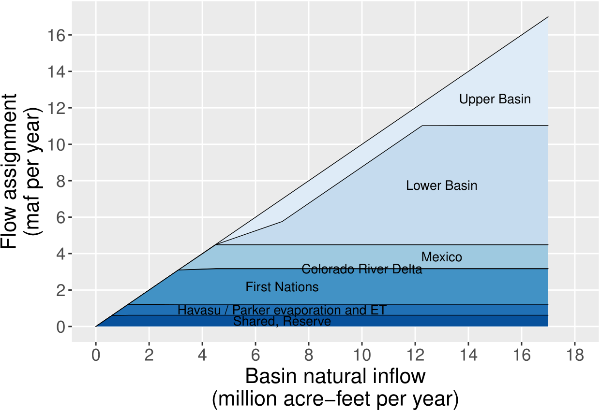
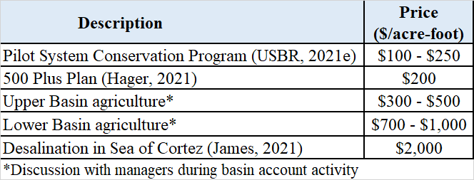
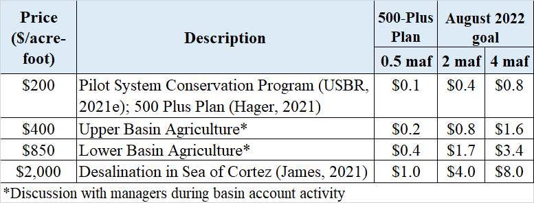
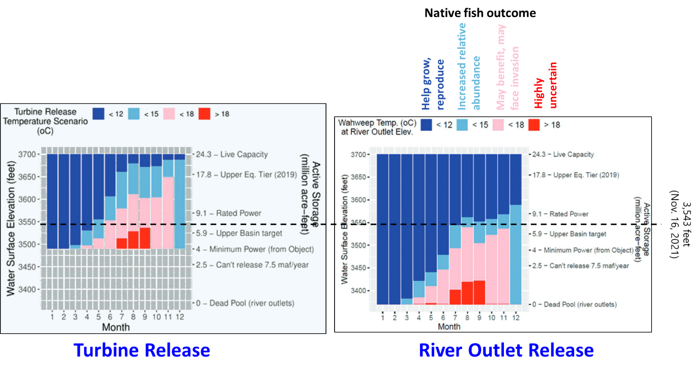

# Model Guide

## Lake Mead Water Bank based on the Principle of Divide Reservoir Inflow

David E. Rosenberg \| Utah State University \|
[david.rosenberg@usu.edu](mailto:david.rosenberg@usu.edu)

\| <http://rosenberg.usu.edu>

November 25, 2024

# I**ntroduction**

The purpose of this tool is to give users the opportunity to immerse in water
user roles and experiment with a Lake Mead Water Bank. The Bank works on the
principles of **A) Divide reservoir inflow**, **B) Subtract evaporation**, and
**C) Users withdraw and conserve within their available water**, others choices,
and real-time discussion of choices. We see uses of the tool for two purposes:.
We see use of the tool for two purposes:

-   As researchers we want to learn *Why* basin partners choose assumptions and
    *how* extreme; *Why* and *how* basin partners articulate their risk of
    uncertain future water supply and manage their vulnerability; and *Which*
    new insights they take from a model session.

-   Provoke discussion about new alternatives for Colorado River management post
    2026 and their possible benefits to:

    -   Stabilize and recover reservoir storage under conditions of low storage
        *and* low inflow, and

    -   Give users more autonomy to manage their vulnerability to water
        shortages.

This document provides context information for each individual and group choice
within the immersive model. The document also explains how choices build on
existing Colorado River management (Appendix A). The document also suggest
potential values to enter for user choices.

Find quick links to this support information -- the sections and subsections of
this document -- in the Model file, *Master* worksheet, Column N.

Requirements

-   **Session Guide**: 1 person to setup in Google Sheets (see Setup below),
    invite participants, and organize play.

-   **Number of People**: 2 or more (Session Guide may also participate).

-   **Time**: 1 to 3 hours.

-   **Software**: Session Guide has a Google Account.

# Instructions to Guide a Model Session

Review the main canons of existing Colorado River management (Appendix A;
persons not familiar with current Colorado River operations).

Follow the setup and play instructions (Box 1). The rest of the document
provides guidance on each step.

## Types of Use

The model can be used in two modes:

1.  Synchronously by multiple participant where each participant manages one or
    more accounts (in Google Drive).

2.  By a single participant (manages all accounts).

Participants can explore:

-   Water conservation and consumptive use strategies.

-   Scenarios of Lake Mead inflow.

-   Joint (political) decisions such as:

    -   Split existing reservoir storage among accounts.

    -   Split future inflows among accounts.

# Step 1. Assign Accounts, Articulate Vulnerabilities, and Strategies to Manage Vulnerability

The Reclamation, California, Arizona, Nevada, and Mexico accounts represent
entities defined in the 1922 Colorado River Compact, US-Mexico Treaty of 1948,
subsequent Minutes 319 and 323, Lower Basin drought contingency plans, and
pledges to include more accounts (Table 1)(1922; IBWC, 2021; USBR, 2019; USBR,
2020). The Tribal Nations of the Lower Basin users represents Tribal Nations and
their settled water rights (Ten Tribes Partnership, 2018).

**Maps of water user areas**

-   [Upper Basin, Lower Basin,
    Mexico](https://www.usbr.gov/lc/images/maps/CRBSmap.jpg) (USGS, 2016)

-   [First
    Nations](http://www.naturalresourcespolicy.org/images/col-river-basin/map-tribes-crb.jpg)
    (Ten Tribes Partnership, 2018)

**Table 1. Accounts, Reason(s) to include in model, and Potential Strategies**

| **Account**                       |                                                                                                             | **Potential Strategy(s)**                                                                                                                                                                                                                                                                                                                                                                                                                           |
|-----------------------------------|-------------------------------------------------------------------------------------------------------------|-----------------------------------------------------------------------------------------------------------------------------------------------------------------------------------------------------------------------------------------------------------------------------------------------------------------------------------------------------------------------------------------------------------------------------------------------------|
| Reclamation                       | Article II(c to g) of the Colorado River Compact (1922). Lower Basin Drought Contingency Plan (USBR, 2019). | Set Lake Mead Protection Elevation of 1,020 feet as defined in the Lower Basin Drought Contingency Plan (USBR, 2019). Lake Mead will not fall below this level. Lower the protection elevation to allocate more active storage to other users                                                                                                                                                                                                       |
| California                        | Article II(c to g) of the Colorado River Compact (1922).                                                    | Continue mandatory conservation and cutback from 4.4 maf per year as Lake Mead level declines from 1,090 to 1,025 feet (USBR, 2019). See cutback schedule in *MandatoryConservation* sheet. These values exclude 0.95 maf per year of use by First Nations in the Lower Basin. Cut back an addition amount per year to represent the 500-Plus Plan (Allhands, 2021). Buy water to reduce mandatory conservation.  Save some water for future years. |
| Arizona                           | Article II(c to g) of the Colorado River Compact (1922).                                                    | Continue mandatory conservation and cutback from 2.8 maf per year as Lake Mead level declines from 1,090 to 1,025 feet (USBR, 2019). See cutback schedule in *MandatoryConservation* sheet. These values exclude 0.95 maf per year of use by First Nations in the Lower Basin. Cut back an addition amount per year to represent the 500-Plus Plan (Allhands, 2021). Buy water to reduce mandatory conservation.  Save some water for future years. |
| Nevada                            | Article II(c to g) of the Colorado River Compact (1922).                                                    | Continue mandatory conservation and cutback from 0.3 maf per year as Lake Mead level declines from 1,090 to 1,025 feet (USBR, 2019). See cutback schedule in *MandatoryConservation* sheet. These values exclude 0.95 maf per year of use by First Nations in the Lower Basin. Cut back an addition amount per year to represent the 500-Plus Plan (Allhands, 2021). Buy water to reduce mandatory conservation.  Save some water for future years. |
| Mexico                            | 1944 U.S.-Mexico Treaty and subsequent Minutes                                                              | Continue mandatory conservation and cutback from 1.5 maf per year as Lake Mead levels decline (IBWC, 2021). See *MandatoryConservation* sheet. Conserve more water beyond mandatory targets. Lease water to get money for non-water projects.                                                                                                                                                                                                       |
| Tribal Nations of the Lower Basin | Include more accounts (USBR, 2020) Tribal water study (Ten Tribes Partnership, 2018)                        | Develop and use 0.95 maf of settled water rights by Tribal Nations in the Lower Basin. Lease settled, undeveloped water to other users to acquire capital to build new projects. Save water for future use.                                                                                                                                                                                                                                         |

A participant can play one or more accounts.

The First Nations account allows First Nations of the Lower Basin to manage
their water independently from the Basin State in which the First Nation was
located. This set up differed from current operations where Basin States
administer water rights for the First Nations within their state boundaries.

Delete the entry in Cell A10 to remove the Tribal Nations of the Lower Basin

user. Removing will reallocate 0.95 maf of settled water rights – add 0.48 maf

to the Arizona and 0.48 maf to California.

## 1A. Explain cell types

Four model cell types are defined by fill color (Table 2).

**Table 2. Model Cell Types**

## 1B. Make Assumptions

### **(i) Evaporation rates**

Evaporation rates for Lake Mead are presently entered as the midpoint within
reported ranges of measurements (Table 3)(Schmidt et al., 2016). Evaporation
rates for Lake Mead are presently measured using state-of-the-art
eddy-covariance however there is a several year delay in reporting values
(Moreo, 2015). A sensitivity analysis found that the lower and upper bounds on
Lake Mead evaporation rates for a five year study for Lake Mead draw down saw
variations of 0.25 maf or less in Lake Mead storage volume.

**Table 3. Reservoir evaporation rates (feet per year)**

| **Reservoir** | **Midpoint** | **Range** |
|---------------|--------------|-----------|
| Mead          | 6.0          | 5.5 – 6.4 |

### (ii) Start storage

Reservoir start storage is taken from the [data
portal](https://www.usbr.gov/lc/region/g4000/hourly/mead-elv.html) (USBR,
2021c). Text in Column D lists the date. Figure 1 shows Lake Mead storage over
time (Solid black line).

**Figure 1. Lake Mead Storage (solid black line), Water Conservation (ICS)
Account Balances (light blue fill), and anticipated lake volume absent the water
conservation program (dashed red line). The conservation program kept Lake Mead
level above elevation 1,020 feet (5.9 million acre-feet) during low lake levels
in 2022.**

### (iii) Protection elevation

The Reclamation user decides the Lake Mead elevation to protect against further
drawdown. An elevation of 1,020 feet was defined in the Lower Basin Drought
Contingency Plan (Figure 1, dark blue fill labeled Protect)(USBR, 2019). More
recently there has been discussion to lower the protect elevation to 1,000 feet
(Buschatzke et al., 2024). The Lake Mead Water Bank maintains the protection
elevation because the Reclamation user is always assigned a share of inflow that
exactly equals the account’s share of evaporation. The protection volume is
calculated from the Elevation-Area-Volume curve for Lake Mead. See worksheet
*Mead-Elevation-Area*.

### (iv) Storage above Protect Zone

This storage value is the Reservoir start storage (Cell C19) minus the
Protection volume (Cell C20)(Figure 1, light and medium blue fills labeled Water
Conservation Accounts and Public Pool). The Storage above the Protect Zone
represents the active storage that can be assigned to user accounts (see Row
35).

### (v) Water Conservation Program (ICS) Total Balance.

This entry is the sum of all existing water conservation program account
balances (Figure 1, light blue fill). These balances are also referred to as the
Intentionally Created Surplus (ICS) account balances and are reported at (USBR,
2021b). Figure 2 shows Water Conservation Account balances over time for the
three Lower Basin states. Reclamation typically publishes values in Spring for
the prior calendar year. Note, Mexico’s water conservation account balance is
not shown in Figure 2.

**Figure 2. Lake Mead Water Conservation (ICS) Account balances over time**

### **(vi) Remaining Storage above the Protect and ICS Balances**

This storage is calculated as the Lake Mead storage above the protection zone
(Cell C21) minus the total water conservation program balances (Cell C21; Blue
Public pool in Figure 2). This storage represents additional storage that may be
allocated to the Lower Basin states or other users (see Step 3 Split storage in
Row 35).

# Step 2. Specify Lake Mead Inflow

Participants together choose the Lake Mead inflow for the year. This inflow
represents the sum of gaged flows for the gages most immediately upstream of
Lake Mead (Table 4).

**Table 4. Stream gages most immediately upstream of Lake Mead and used to
calculate Lake Mead inflow.**

| **Gage Name**                                              | **USGS Number** | **Years**       | **Link**                                                                                        |
|------------------------------------------------------------|-----------------|-----------------|-------------------------------------------------------------------------------------------------|
| A. Colorado River nr Peach Springs                         | 9404200         | 1990 to Present | [Here](https://waterdata.usgs.gov/monitoring-location/09404200/#parameterCode=00065&)           |
| B. Virgin River at Littlefield                             | 9415000         | 1990 to Present | [Here](https://waterdata.usgs.gov/monitoring-location/09415000/#parameterCode=00065&period=P7D) |
| C. Las Vegas Wash Below LAKE LAS VEGAS NR BOULDER CITY, NV | 9419800         | 2002 to Present | [Here](https://waterdata.usgs.gov/monitoring-location/09419800/)                                |

Because Lake Mead inflow is uncertain—and likely differing from historical
inflows because of climate change—we can only specify inflow as a scenario
(Table 5)(Rosenberg, 2022).

**Table 5. Scenarios of Lake Mead Inflow (Rosenberg, 2022)**.

For reference, historical Lake Mead inflows since 1990 varied from 8 to 16
million acre-feet per year (Figure 3) with the preponderance of inflows between
9 and 10 maf per year (corresponding to a Lake Powell release between 8.23 and 9
maf per year; Figure 4).

**Figure 3. Lake Mead inflow as measured by nearest USGS gages.**

**Figure 4. Histogram of Lake Mead inflows as measured by the nearest gages.**

Additionally note that Colorado River flow near Peachtree is the annual Lake
Powell release plus 600,000 to 1 million acre-feet of gains along Grand Canyon
(Rosenberg, 2022; Wang and Schmidt, 2020; Figure 5).

**Figure 5. Mean Grand Canyon tributary flow (Glen Canyon Dam to Lake Mead) for
different sequence lengths.**

Further note that different methods to estimate Lake Mead inflow give different
values (Figure 6). For example:

-   Nearest USGS gages.

-   Inflow data downloaded from the Reclamation Application Programming
    Interface (API; https:

-   //www.usbr.gov/lc/region/g4000/riverops/_HdbWebQuery.html).

-   Back calculate from Lake Mead storage, release, Nevada Diversion, and Lake
    Mead evaporation data also retrieved from the Reclamation API.

-   Back calculate from Lake Mead storage, release, Nevada Diversion, and Lake
    Mead evaporation (1990 to present). Here we use evaporation data from
    elevation-storage-area relationship from Colorado River Simulation System
    (CRSS) model.

**Figure 6. Differing values for Lake Mead inflow as estimated by different
methods.**

This work uses gages closest to Lake Mead because these values gave the
*largest* annual inflows.

# Step 3. Split existing Lake Mead storage among accounts (year 1 only)

Participants split the starting Lake Mead active storage specified in Row 19
among the users. This split is a joint choice (Orange Cells B36 to B41). There
are many possibilities.

However, suggestions for the split can be informed by the prior choice for the
Reclamation Protect Elevation (Cell B20) and existing Water Conservation (ICS)
Account Balances (Figures 1 and 2; Table 6). When using existing Water
Conservation Account balances, users can access **all** of the prior conserved
water (rollover) and current account balance at **any time** because the
protection volume ensures a minimum storage volume and account balances must
always stay zero or positive. In this setup, *there is no trigger to prohibit
debits.*

**Table 6. Suggested split of existing Lake Mead storage**

| **User**    | **Suggested initial volume**                                                                             |
|-------------|----------------------------------------------------------------------------------------------------------|
| Reclamation | Protection volume entered in Row 20. This level is shown as elevation 1,020 feet in Figure 1.            |
| California  | Water Conservation (ICS) account balance shown in Figure 2 (rollover).                                   |
| Arizona     | Water Conservation (ICS) account balance shown in Figure 2 (rollover).                                   |
| Nevada      | Water Conservation (ICS) account balance shown in Figure 2 (rollover).                                   |
| Mexico      | Water Conservation account balance under Minutes 323 to the U.S.-Mexico Treaty (IBWC, 2021; USBR, 2019). |
| Other users | Remaining water in the Public Pool shown in Figure 1.                                                    |

If the Lake Mead active storage minus the Water Conservation Account balances:

-   Fall below the Reclamation protect elevation (such as in 2022 in Figure 1),
    the states will need to negotiate the split. In this case, states will
    receive less than their water conservation account balance.

-   Are above the Reclamation protect elevation (such as in 2008 to 2021 and
    2023), the additional water (Public pool in Figure 1) can be assigned to
    other users such as Tribal Nations of the Lower Basin.

In actuality, the participants will negotiate over a share of the existing
reservoir storage. In these negotiations, participants will get the same or more
storage water as they get with current operations.

## 3A. Begin of year reservoir storage

In Year 1 (Column C), beginning of year reservoir storage is the Lake Powell and
Lake Mead volumes specified in Section 1B.

In subsequent years (Columns D, E, …), the Lake Powell and Lake Mead storage
volumes are the volumes decided by accounts at the end of the prior year.

## 3B. Calculate Powell + Mead Evaporation

Reservoir evaporation volume is the product of (i) annual evaporation rate (see
Section 1B), and the lake surface areas associated with the current reservoir
volumes. Find the Elevation-Storage-Area relationships on the
*Powell-Elevation-Area* and *Mead-Elevation-Area* worksheets (far right). Data
were download from the Colorado River Simulation System (CRSS) model (Wheeler et
al., 2019; Zagona et al., 2001).

The combined reservoir evaporation is divided among basin accounts in proportion
to the account balance (Equation 1, evaporation terms in maf per year, balance
and storage terms in maf).

 Equation 1

For example, if the combined evaporation is 1.0 maf and Upper Basin has 10% of
the combined storage, then the Upper Basin is assigned 10% of the combined
evaporation or 0.1 maf that year.

## 3C. Calculate Mexico Water Allocation

Mexico’s water allocation is its 1.5 maf per year treaty amount, minus mandatory
conservation volumes specified in Minutes 319 and 323 for declining Lake Mead
levels(Table 5), minus Mexico’s contribution to the Colorado River Delta listed
in Minute 323 (IBWC, 2021), minus Mexcio’s portion of the Lake Havasu / Parker
evaporation and evapotranspiration. The *MandatoryConservation* sheet shows the
Mexico and Lower Basin conservation schedules.

**Table 5. Mexico Mandatory Conservation under Minutes 319 and 323**

# Split combined natural inflow among accounts

Participants split the basin natural inflow among accounts (Figure 7). Basin
natural inflows include natural inflow to Lake Powell, plus intervening Grand
Canyon inflow, plus Mead to Imperial Dam intervening inflow (see Sections 2A-C).

**Figure 7. Split natural flow among Colorado River basin accounts.**

There are lots of ways to split inflow among the basin accounts. Table 6
justifies the default splits shown in Figure 7 that draw on existing operations.

**Table 6. Assign inflow to accounts**

|    | **Step**                                                                                                                                                                                                                                                                                                                              | **Existing Operations**                               |
|----|---------------------------------------------------------------------------------------------------------------------------------------------------------------------------------------------------------------------------------------------------------------------------------------------------------------------------------------|-------------------------------------------------------|
| 1. | Assign the **shared, reserve account** the *first block of inflow* to exactly offset the evaporation volume of the account. This assignment keeps the shared, reserve balance steady year to year. Volume depends on reservoir storage.                                                                                               | Drought Contingency Plans (USBR, 2019)                |
| 2. | Assigned inflow to equal Lake Havasu / Parker evaporation and evapotranspiration. This assignment is drawn from inflow assignments to Mexico, Lower Basin, and First Nations in the Lower Basin.                                                                                                                                      | None. Existing operations do not discus these losses. |
| 3. | Assigned **First Nations** the next *1.94 maf* per year of decreed water rights because First Nations managed their water independently of Basin States. The volume is 1.06 plus 0.952 maf in the Upper and Lower Basins minus First Nations in the Lower Basin’s share of Havasu/Parker losses. The amount excludes claimed amounts. | Tribal Water Study (Ten Tribes Partnership, 2018).    |
| 4. | Assigned the **Colorado River Delta** the next *0.016 maf* of inflow. This volume is 67% of the 9-year, 0.21 maf volume pledged by the U.S. and Mexico.                                                                                                                                                                               | Minute 323 (IBWC, 2021)                               |
| 5. | Assigned **Mexico** the next *1.5 maf* of inflow *minus mandatory conservation minus Mexico’s portion* of Havasu/Parker losses. Mandatory conservation volumes increase as Lake Mead level’s decreases (see Section 3C).                                                                                                              | 1944 Treaty, Minutes 319 and 323 (IBWC, 2021)         |
| 6. | Split the next 2.4 maf per year natural flow between the **Upper** and **Lower Basins** because the Basins have 1.2 and 2.45 maf per year of pre-1922 water rights after deducting use by First Nations.                                                                                                                              | (Leeflang, 2021; Ten Tribes Partnership, 2018)        |
| 7. | Assign the **Lower Basin** the next 5.3 *maf* of natural flow. 5.2 maf plus 1.2 maf pre-1922 use plus 0.95 maf of First Nations use below Hoover dam plus half of Mexico’s assignment resulted in 8.2 maf per year that is the Lake Powell objective release.                                                                         | 1922 Compact Article III(d)                           |
| 7. | Assign the **Upper Basin** *all remaining* Lake Powell natural flow.                                                                                                                                                                                                                                                                  | 1922 Compact Article III(d)                           |

Figure 7 and Table 6 are one way to assign natural inflow to the basin accounts.
Other methods may prioritize the Colorado River Delta, First Nations, and Mexico
differently.

# Step 5. Participant Dashboards – Conserve, Consume, and Trade

Each participant has a dashboard where they can trade, conserve, and consume
their available water (Figure 8).

**Figure 8. Upper Basin Dashboard annotated. A Lake Powell natural flow of 9 maf
gives the Upper Basin 5.7 maf of available water to sell or consume. No trades
or withdraws have been entered.**

### (i) Buy or sell water from other participants(s)

Enter buy amounts as positive (+) and sell amounts negative (-). These are
additions and subtractions to the account’s available water. Enter all amounts
in maf. If multiple transactions – e.g, buy 0.5 maf from Lower Basin and 0.2 maf
from Mexico -- enter as a formula: = 0.5 + 0.2

**These transactions are all temporary – for one year!**

When a buying account requires a selling account to invest financial proceeds in
new farm or urban water conservation efforts, the money stays in the local
community and the seller can make more water available in future years
(Rosenberg, 2021c).

### (ii) Compensation

Enter compensation – payments for buying, receipts for sales – in \$ millions.
Enter as a formula. Multiply the sale price in \$/acre-foot by the buy or sell
volume in maf. Table 7 shows rough Colorado River water prices. Table 8 shows
example compensation for different water prices and target water volumes.

-   For example, a purchase of 0.5 maf at \$500 per acre-foot is (0.5)(500) =
    \$250 million.

-   If a participant buys 0.5 maf at \$500 per acre-foot from one participant
    and 0.2 maf at \$1,200 per acre-foot from a second participant, the
    compensation formula is:

Compensation = (0.5)(500) + (0.2)(1,200) = \$850 million.

The recently proposed 500-Plus plan seeks to reduce Lower Basin water use by 0.5
maf per year (Allhands, 2021). Potential compensation amounts are shown in green
fill in Table 8.

**Table 7. Approximate Colorado River water prices**

**Table 8. Compensation at different water prices to purchase different target
water volumes (\$ billion)**

### (iii) Net Trade Volume all Participants

Confirm the net trade volume for all participants is zero. A zero balance
indicates there is a buyer for every seller.

### (iv) Available Water

Available water is the water available to a participant to consume, conserve, or
sell to another account. Sales decrease and purchases increase available water
(Eq. 2).

|  | (Eq. 2) |
|-------------------------------------------------|---------|

### (v) Enter Withdraw within Available Water

Account withdraws are consumptive use. This consumptive use occurs by a
participant physically withdrawing from the combined Lake Powell-Lake Mead
system at Hoover dam (Lower Basin, Mexico, or Delta). Consumptive use can also
occur by diverting instream flow before that flow enters the combined system
(Upper Basin). In the later case, the Upper Basin diverts the water and its
basin account is deducted the corresponding consumptive use.

Enter withdraws and consumptive use according to the strategy identified in Step
1 or modifications to that strategy based on current conditions.

Check that other participants do not withdraw more water than is available to
them!

### (vi) End of Year Balance

The account balance at the end of the year after deducting withdraws and
consumptive use. End of Year balance = Available Water – Withdraw.

## 5A. Shared, Reserve Dashboard

The dashboard for the shared, reserve account is orange fill – all accounts must
agree to a purchase or sale (Figure 9).

**Figure 9. Shared, Reserve account choices are a joint decision by all
participants.**

The current recommendation is keep the shared, reserve account balance steady –
no sales or gifts to participants in distress.

Selling or gifting water from the shared, reserve account to other accounts will
lower Lake Powell and/or Lake Mead levels:

-   Reduce storage in Lake Powell, heat the water temperature of Lake Powell
    storage (less stratification), increase the release water temperature, and
    push native, endangered fish of the Grand Canyon into unchartered territory
    \-- more susceptible to prey by non-native fish. Higher Lake Powell levels
    and colder releases maintain the status quo for endangered fish. The
    worksheet *PowellReleaseTemperature* provides a table and figure of the
    impacts on fish of less water storage in Lake Powell.

-   Reduce the head available for hydropower generation, and speed the time that
    reservoirs reach their minimum power pools (where they can no longer
    generate energy). When energy generation declines, power customers must go
    on the spot energy market to purchase the energy shortfall. The model of
    Colorado River basin accounts not quantify the impacts of reduced hydropower
    generation.

Both impacts will depend on how combined storage is split between Lake Powell
and Lake Mead (see next section).

# Step 6. Summary of Participant Actions

Shows participant actions grouped by Purchases and Sales, Account Withdraws, and
Account end-of-year balances. These groupings can help see whether sales
balanced purchases and also overall water consumption for the year.

## 6A. Combined Storage – End of Year

The combined storage – end of the year is the combined storage in Lake Powell
and Lake Mead at the end of the year after all account withdraws and consumptive
use. This volume is the sum of the end-of-year- balances in all accounts.

# Step 7. Assign Combined Storage to Powell and Mead

All participants together assign the end-of-year combined storage to Lake Powell
and Lake Mead. Enter as percent where 50% splits the combined storage equally
between the two reservoirs and 75% places more storage in Lake Powell.

After entering a percent split, the following items will calculate:

### (i) Powell and Mead storage volumes and levels

The model uses the elevation-area-volume relationships for the reservoirs to
calculate storage level from volume. See the left and right hand side of Figure
11 for critical levels and volumes such as dead pool (0 maf storage) and minimum
power pool (penstock elevations) to avoid.

### (ii) Lake Powell release to achieve Powell and Mead storage volumes

This is the annual release from Lake Powell to achieve the specified storage
volumes in Lake Powell and Lake Mead. Compare to numbers such as 7 to 9 maf per
year that are the target of equalization releases (Figure 13)(USBR, 2007). Note
that as combined storage declines, it will become harder to achieve the 7-9 maf
targets. This Powell release is calculated as (all terms maf):

Powell Release = -[Powell end storage] + [Powell start storage] + [Powell
natural inflow] – [Upper Basin consume] – [Powell evaporation] (Equation 3)

A negative release is infeasible and means too much water is already in Lake
Mead. Specify a lower percentage in Step 7 – lower Powell end storage.

### (iii) Turbine release water temperature

The temperature of water released through the Lake Powell penstocks to generate
hydropower. This data is pulled from observations of release water temperature
and temperature profiles at Wahweap (Wheeler et al., 2021, Appendix 1).

### (iv) Suitability for native, endangered fish of the Grand Canyon

As Lake Powell release water temperature rises, outcomes become more uncertain
for endangered, native fish of the Grand Canyon. The endangered, native fish
become more susceptible to competition and prey by introduced non-native fish.
Colder releases preserve the status quo. Table 9 shows the breakpoints of
temperature suitability for native fish (Wheeler et al., 2021, Appendix 1).

### (v) Suitability for tailwater trout

The tailwater trout are an introduced species, require colder water, and live in
the Colorado River reach from Glen Canyon Dam to Lee Ferry (and possibly below).
Table 9 shows the breakpoints of temperature suitability for tailwater trout
(Wheeler et al., 2021, Appendix 1).

Box 2 shows an example of the impacts of 13.8 maf of combined storage if assign
65% of that storage to Lake Powell.

## 7A. Consider four issues to split the combined storage between the two reservoirs:

### (i) Preserve status quo for endangered, native fish of the Grand Canyon

As Lake Powell water storage drops to the turbine release elevation of 3,490
feet (4 maf), the water stored in Lake Powell heats (less stratification),
increases release water temperature through the hydropower turbines, and
increases uncertainty in outcome for endangered, native fish of the Grand
Canyon. The endangered, native fish become more susceptible to prey by
non-native fish (Figure 10, left). Higher Lake Powell levels and colder water
releases preserve the status quo. Table 9 summarizes the important Lake Powell
elevation break points for fish. To delay these negative impacts on fish,
managers can forego release and hydropower generation through the turbines and
instead release water through the low elevation river outlets (elevation 3,370
feet; 0 maf; Figure 11). For example, an 18oC release through the river outlets
requires 5.9 maf less storage than an 18oC release through hydropower turbines
(elevation 3,600 feet on Figure 11 left plot compared to 3,525 feet on right
plot). This information is also presented on the *PowellReleaseTemperature*
worksheet.

****

**Figure 10. Lake Powell release water temperatures through the hydropower
turbines (elevation 3,490 feet; left) and river outlets (elevation 3,370 feet;
right) for different water surface elevations (Wheeler et al., 2021). Dashed
black line represents Nov 16, 2021 storage.**

**  
**

**Table 9. Effects of Summer Lake Powell Elevation on Fish**

Figure 11. Glen Canyon Dam river outlets (red) are \~ 100 feet below the
penstocks (blue)

### (ii) Reduce Hydropower Generation

Reduced water surface elevation reduces hydropower generation and speeds the
time that reservoirs reach their minimum power pools (elevations 3,490 and 955
feet in Lake Powell and Lake Mead) where the reservoirs can no longer generate
energy. When energy generation declines, Lake Powell and Lake Mead energy
customers must go on the spot energy market to purchase the energy shortfall.
The model of Colorado River basin accounts does not quantify the impacts of
reduced hydropower generation.

### (iii) Reduce evaporation loss

The combined evaporated volume changes less than 0.12 maf to preferentially
store water in Lake Mead or Lake Powell (Figure 12, red numbers). These volumes
are inside the margin of error of the evaporated volumes (Figure 12, black bars)
calculated from the evaporation rates (Section 1Bi). This analysis suggests
there is no water supply or evaporation benefit to preferentially store combined
storage in Lake Powell or Lake Mead.

**Figure 12. Combined evaporated volume changes little (red numbers) to
preferentially store water in Lake Mead or Lake Powell.**

### (iv) Current operations

Since 2007, the current operations sought to equalize storage in Lake Powell and
Lake Mead (enter 50%)(USBR, 2007). Prior to 2007, managers kept more storage in
Lake Mead (Figure 13).

**Figure 13. Lake Powell-Lake Mead coordination rules (blue fill) and historical
lake levels before and after the 2007 interim guidelines (pink and purple
lines)(Wheeler et al., 2019).**

# Step 8. Move to next year

Move to next year. Move to Step 2 Specify natural inflow to Lake Powell in the
next year (next column). Repeat Steps 2 to 7 for each year.

The purpose of the Colorado River basin accounts activity is to provoke thought
and discussion about new Lake Powell and Lake Mead operations. So continue to
play years so long as the discussion provokes new insights.

# Step 9. Finish

Congratulations. You finished! If you wish to provide feedback – things you
liked, things to improve – please send an email to david.rosenberg@usu.edu.

# Data, Model, and Code Availability

The data, code, and directions to generate figures in this post are available on
Github.com at Rosenberg (2021b).

# Requested Citation

David E. Rosenberg (2021). "Model Guide: Colorado River Basin Accounts." Utah
State University.
<https://github.com/dzeke/ColoradoRiverCoding/tree/main/ModelMusings>.

# Appendix 1. Summary of Current Colorado River Operations

The Colorado River basin has a long history. The parties do not get along. There
is much written material. This appendix summarizes key pieces and provides links
to the actual documents:

1.  [**Map**](https://www.usbr.gov/lc/images/maps/CRBSmap.jpg) shows Upper
    Basin, Lower Basin, Glen Canyon Dam/Lake Powell, Hoover Dam/Lake Mead, and
    diversions inside and outside the hydrologic basin (USBR, 2012).

2.  **Compacts, treaties, and agreements** in 1922, 1928, 1944, 1956, 1964, and
    1968 -- <https://www.usbr.gov/lc/region/g1000/lawofrvr.html>.

1.  **2007 Interim Guidelines**. Lower Basin states increase mandatory
    conservation as Lake Mead level falls from 1,075 to 1,025 feet;
    Intentionally created surplus (aka conservation) accounts in Lake Mead for
    Lower Basin states (Section 3); Equalize storage in Lake Powell and Lake
    Mead (Section 6).
    <https://www.usbr.gov/lc/region/programs/strategies/RecordofDecision.pdf>.

1.  **2012 and 2017. Minutes 319 and 323 to the 1944 US-Mexico Treaty**. Mexico
    increases mandatory conservation as Lake Mead’s level falls from 1,090 to
    1,025 feet. <https://www.ibwc.gov/Treaties_Minutes/Minutes.html>.

1.  **2018 Ten Tribes Partnership Water Study.** Quantified 2.0 million
    acre-feet (maf) rights in Upper and Lower Basins and 0.8 maf claims.
    https://www.usbr.gov/lc/region/programs/crbstudy/tws/finalreport.html.

2.  **2019 Upper Basin Drought Contingency Plan.** Protect Lake Powell elevation
    of 3,525 feet (5.9 maf). Prevent Lake Powell to fall to minimum power pool
    elevation of 3,490 feet (4.0 maf). https://www.usbr.gov/dcp/finaldocs.html.

3.  **2019 Lower Basin Drought Contingency Plan.** Increase mandatory
    conservation targets as Lake Mead’s level falls from 1,090 feet to 1,025
    feet. See current mandatory conservation schedule in (Castle and Fleck,
    2019). Protect Lake Mead from falling below elevation 1,020 feet.
    <https://www.usbr.gov/dcp/finaldocs.html>.

4.  **2021 Lower Basin 500 Plus Plan.** The Lower Basin states and Federal
    government agree to pay \$200 million to conserve 0.5 maf each year for two
    years (Allhands, 2021).

5.  **2026.** **Interim Guidelines and Drought Contingency Plans expire.**

6.  **Castle and Fleck (2019)**:

    1.  Summarize current Colorado River operations in more detail than Items
        \#1-9.

    2.  Describe what happens when the Upper Basin is unable to deliver 8.23
        million acre-feet (maf) of water per year to Lower Basin as required in
        the 1922 Compact and 1944 US-Mexico Treaty.

1.  **Kuhn and Fleck (2019)** give a well written history of Colorado River
    management. Read this piece for fun or to go in depth on a particular piece
    of management.

# References

Allhands, J. (2021). "It could take at least 500,000 acre-feet of water a year
to keep Lake Mead from tanking." *Arizona Republic*, November 8, 2021.
<https://www.azcentral.com/story/opinion/op-ed/joannaallhands/2021/11/08/lake-mead-could-get-extra-water-from-lower-basin-annually/6306601001/>.

Buschatzke, T., Hamby, J. B., and Entsminger, J. (2024). "Lower Basin
Alternative for the Post-2026 Coordinated Operation of the Colorado River
Basin."
<https://www.snwa.com/assets/pdf/lower-basin-alternative-letter-march2024.pdf>
[Accessed on: August 14, 2024].

Castle, A., and Fleck, J. (2019). "The Risk of Curtailment under the Colorado
River Compact." *SSRN eLibrary*. <http://dx.doi.org/10.2139/ssrn.3483654>.

Colorado River Compact. (1922).
<https://www.usbr.gov/lc/region/pao/pdfiles/crcompct.pdf> [Accessed on: October
5, 2021].

IBWC. (2021). "Minutes between the United States and Mexican Sections of the
IBWC." United States Section,
<https://www.ibwc.gov/Treaties_Minutes/Minutes.html> [Accessed on: July 22,
2021].

Kuhn, E., and Fleck, J. (2019). *Science Be Dammed: How Ignoring Inconvenient
Science Drained the Colorado River*, University of Arizona Press.

Leeflang, B. (2021). "Colorado River Coding: Pre 1922 Compact Water Use."
<https://doi.org/10.5281/zenodo.5501466>.

Moreo, M. T. (2015). "Evaporation data from Lake Mead and Lake Mohave, Nevada
and Arizona, March 2010 through April 2015." U.S. Geological Survey Data
Release. <http://dx.doi.org/10.5066/F79C6VG3>.

Prairie, J. (2020). "Colorado River Basin Natural Flow and Salt Data." U.S.
Bureau of Reclamation.
<https://www.usbr.gov/lc/region/g4000/NaturalFlow/current.html>.

Rosenberg, D. E. (2021a). "Colorado River Coding: Grand Canyon Intervening
Flow." GrandCanyonInterveningFlow folder,
<https://doi.org/10.5281/zenodo.5501466>.

Rosenberg, D. E. (2021b). "Colorado River Coding: Intentionally Created Surplus
for Lake Mead: Current Accounts and Next Steps." ICS folder,
<https://doi.org/10.5281/zenodo.5501466>.

Rosenberg, D. E. (2021c). "Invest in Farm Water Conservation to Curtail Buy and
Dry." *Submitted to Journal of Water Resources Planning and Management*, 3.
<https://digitalcommons.usu.edu/water_pubs/169/>.

Rosenberg, D. E. (2022). "Adapt Lake Mead Releases to Inflow to Give Managers
More Flexibility to Slow Reservoir Drawdown." *Journal of Water Resources
Planning and Management*, 148(10), 02522006.
<https://doi.org/10.1061/(ASCE)WR.1943-5452.0001592>.

Salehabadi, H., Tarboton, D., Kuhn, E., Udall, B., Wheeler, K., E.Rosenberg, D.,
Goeking, S., and Schmidt, J. C. (2020). "Stream flow and Losses of the Colorado
River in the Southern Colorado Plateau." Center for Colorado River Studies, Utah
State University, Logan, Utah.
<https://qcnr.usu.edu/coloradoriver/files/WhitePaper4.pdf>.

Schmidt, J. C., Kraft, M., Tuzlak, D., and Walker, A. (2016). "Fill Mead First:
a technical assessment." Utah State University, Logan, Utah.
<https://qcnr.usu.edu/wats/colorado_river_studies/files/documents/Fill_Mead_First_Analysis.pdf>.

Ten Tribes Partnership. (2018). "Colorado River Basin Ten Tribes Partnership
Tribal Water Study." U.S. Department of the Interior, Bureau of Reclamation, Ten
Tribes Partnership.
<https://www.usbr.gov/lc/region/programs/crbstudy/tws/finalreport.html>.

USBR. (2007). "Record of Decision: Colorado River Interim Guidelines for Lower
Basin Shortages and Coordinated Operations for Lakes Powell and Mead." U.S.
Bureau of Reclamation.
<https://www.usbr.gov/lc/region/programs/strategies/RecordofDecision.pdf>.

USBR. (2012). "Colorado River Basin Water Supply and Demand Study." U.S.
Department of Interior, Bureau of Reclamation, Washington, D.C.,
<https://www.usbr.gov/lc/region/programs/crbstudy.html>.

USBR. (2019). "Agreement Concerning Colorado River Drought Contingency
Management and Operations." U.S. Bureau of Reclamation, Washington, DC.
<https://www.usbr.gov/ColoradoRiverBasin/dcp/index.html>.

USBR. (2020). "Review of the Colorado River Interim Guidelines for Lower Basin
Shortages and Coordinated Operations for Lake Powell and Lake Mead." U.S. Bureau
of Reclamation, U.S. Department of Interior.
<https://www.usbr.gov/ColoradoRiverBasin/documents/7.D.Review_FinalReport_12-18-2020.pdf>.

USBR. (2021a). "21st Century Colorado River: Hydrology and Risk of Lake Mead
Reaching Critically Low Elevations." U.S. Bureau of Reclamation.
<https://github.com/dzeke/ColoradoRiverCoding/raw/main/500PlusPlan/MeadRisk-LBActionsWebianr11-5-21.pdf>.

USBR. (2021b). "Boulder Canyon Operations Office - Program and Activities: Water
Accounting Reports." U.S. Bureau of Reclamation.
<https://www.usbr.gov/lc/region/g4000/wtracct.html>.

USBR. (2021c). "Lake Mead at Hoover Dam, End of Month Elevation." Lower Colorado
River Operations, U.S. Buruea of Reclamation,
<https://www.usbr.gov/lc/region/g4000/hourly/mead-elv.html> [Accessed on:
October 5, 2021].

USBR. (2021d). "Lake Powell Unregulated Inflow."
<https://www.usbr.gov/uc/water/crsp/studies/images/PowellForecast.png> [Accessed
on: September 28, 2021].

USGS. (2016). "Colorado River Basin map." U.S. Geological Survey.
<https://www.usgs.gov/media/images/colorado-river-basin-map>.

Wheeler, K., Kuhn, E., Bruckerhoff, L., Udall, B., Wang, J., Gilbert, L.,
Goeking, S., Kasprak, A., Mihalevich, B., Neilson, B., Salehabadi, H., and
Schmidt, J. C. (2021). "Alternative Management Paradigms for the Future of the
Colorado and Green Rivers." Center for Colorado River Studies, Utah State
University, Logan, Utah.
<https://qcnr.usu.edu/coloradoriver/files/WhitePaper_6.pdf>.

Wheeler, K. G., Schmidt, J. C., and Rosenberg, D. E. (2019). "Water Resource
Modelling of the Colorado River – Present and Future Strategies." Center for
Colorado River Studies, Utah State University, Logan, Utah.
<https://qcnr.usu.edu/coloradoriver/files/news/White-Paper-2.pdf>.

Zagona, E. A., Fulp, T. J., Shane, R., Magee, T., and Goranflo, H. M. (2001).
"Riverware: A Generalized Tool for Complex Reservoir System Modeling." *JAWRA
Journal of the American Water Resources Association*, 37(4), 913-929.
<https://doi.org/10.1111/j.1752-1688.2001.tb05522.x>.
